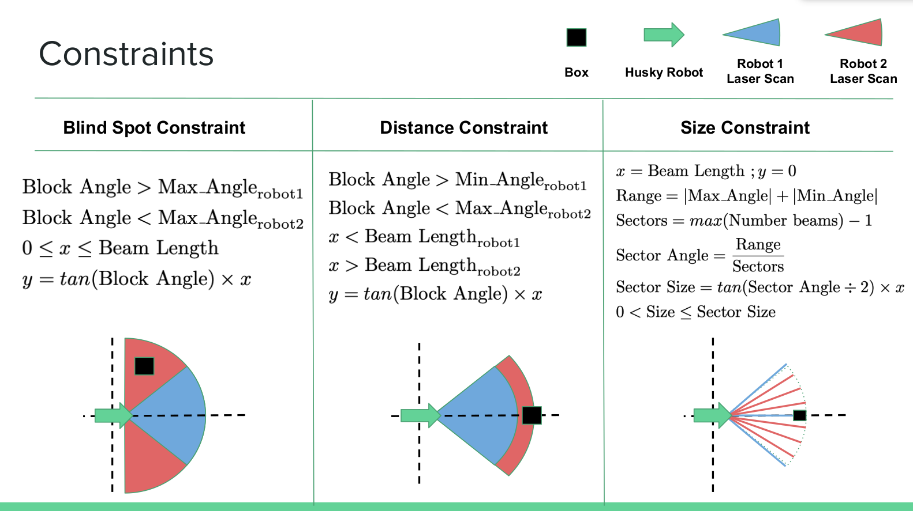

# Constraints Generation

This folder contains the models of the three different tests we wanted to run. The constraints we generate are:

* Blind spot constraint
* Distance constraint
* Size constraint

Each of these constraints is described below in the image:



## Prerequisits

You need to have Z3 installed in order to run this code. To install that please look in the docs folder for installing Z3.

## Running the code

To run this code you can run:

```
$ python3 <File Name>
```

## Authors

* **Carl Hildebrandt** - *Initial work* - [hildebrandt-carl](https://github.com/hildebrandt-carl)
* **Melony Bennis** - *Initial work* - [mmb4vu](https://github.com/mmb4vu)